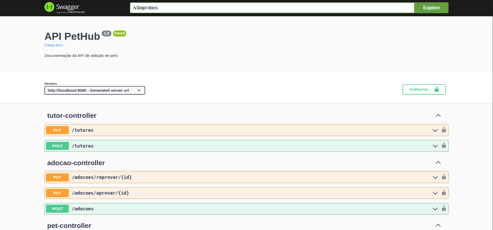

## 💻 Sobre o projeto

PetHub é um site fictício de adoção de pets, com funcionalidades para cadastro de tutores, de abrigos e de pets, além de solicitação de adoções. Nesse repositório o projeto será uma API Rest em Java do Adopet.

---

## ⚙️ Funcionalidades

- [x] Cadastro/atualização de tutores;
- [x] Cadastro de abrigos;
- [x] Cadastro de pets do abrigo;
- [x] Listagem de pets disponíveis para adoção;
- [x] Solicitação de adoção;
- [x] Aprovação/reprovação de adoção;

---

## 🛠 Tecnologias

O projeto foi desenvolvido utilizando as seguintes tecnologias:

- **[Java 17](https://www.oracle.com/java/)**
- **[Spring Boot 3.1](https://spring.io/projects/spring-boot)**
- **[Maven](https://maven.apache.org/)**
- **[MySQL](https://www.mysql.com/)**
- **[Hibernate / JPA](https://hibernate.org/)**
- **[Flyway](https://flywaydb.org/)**
- **[Spring Security](https://spring.io/projects/spring-security)**
- **[JWT (JSON Web Tokens)](https://github.com/jwtk/jjwt)**
- **[Spring Validation](https://docs.spring.io/spring-framework/reference/validation.html)**
- **[Spring Mail](https://spring.io/projects/spring-boot)**
- **[Springdoc OpenAPI](https://springdoc.org/)**
- **[Lombok](https://projectlombok.org/)**
- **[H2 Database](https://www.h2database.com/) (para testes)**
- **[JUnit 5](https://junit.org/junit5/)**
- **[Mockito](https://site.mockito.org/)**
---

## 📄 Documentação da API

A documentação completa da API pode ser acessada via **Swagger UI**, que fornece uma interface interativa para testar os endpoints.

### 🔗 Acessando a documentação
[](https://github.com/MartnsDev/PetHub/blob/96685891faee03d7f33538b77c1d26e7027bca1c/Swagger-Doc.png)

Após rodar a aplicação localmente, acesse:

```
http://localhost:8080/swagger-ui.html
```
ou, dependendo da configuração do Springdoc:

```
http://localhost:8080/swagger-ui/index.html
```
---
### 📌 Endpoints principais

A API possui os seguintes recursos:

#### Tutores
- `POST /tutores` – Cadastrar um novo tutor
- `GET /tutores` – Listar todos os tutores
- `PUT /tutores/{id}` – Atualizar dados de um tutor
- `DELETE /tutores/{id}` – Remover um tutor

#### Abrigos
- `POST /abrigos` – Cadastrar um novo abrigo
- `GET /abrigos` – Listar todos os abrigos
- `GET /abrigos/{id}` - Listar aquele abrigo específico (id)
- `GET /abrigos/{id}/pets` - Lista todos os pets daquele abrigo
- `PUT /abrigos/{id}` – Atualizar dados de um abrigo
- `DELETE /abrigos/{id}` – Remover um abrigo

#### Pets
- `POST /pets` – Cadastrar um pet em um abrigo
- `GET /pets` – Listar todos os pets
- `GET /pets/disponiveis` – Listar pets disponíveis para adoção
- `PUT /pets/{id}` – Atualizar dados de um pet
- `DELETE /pets/{id}` – Remover um pet

#### Adoções
- `POST /adocoes` – Solicitar adoção de um pet
- `PUT /adocoes/{id}/aprovar` – Aprovar adoção
- `PUT /adocoes/{id}/reprovar` – Reprovar adoção
- `GET /adocoes` – Listar solicitações de adoção

> Todos os endpoints estão documentados no Swagger, incluindo os modelos de request/response, validações e códigos de status.

---

## 📝 Licença

O projeto desse repositório inicialmente foi desenvolvido por [Alura](https://www.alura.com.br) e utilizado nos cursos de boas práticas de programação com Java.

Instrutor: [Rodrigo Ferreira](https://cursos.alura.com.br/user/rodrigo-ferreira)

---
